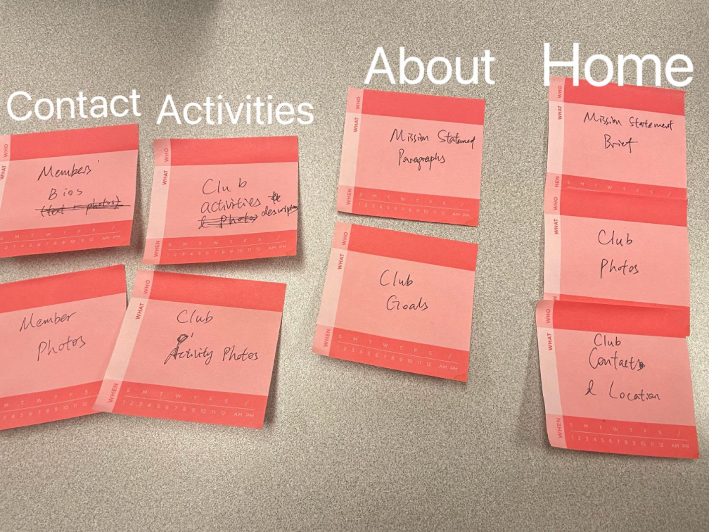

# Group Project: Design Journey

**For each milestone, complete only the sections that are labeled with that milestone.** Refine all sections before the final submission.

You are graded on your design process. If you later need to update your plan, **do not delete the original plan, leave it in place and append your new plan _below_ the original.** Then explain why you are changing your plan. Any time you update your plan, you're documenting your design process!

**Replace ALL _TODOs_ with your work.** (There should be no TODOs in the final submission.)

Be clear and concise in your writing. Bullets points are encouraged.

Place all design journey images inside the "design-plan" folder and then link them in Markdown so that they are visible in Markdown Preview.

**Everything, including images, must be visible in _Markdown: Open Preview_.** If it's not visible in the Markdown preview, then we can't grade it. We also can't give you partial credit either. **Please make sure your design journey should is easy to read for the grader;** in Markdown preview the question _and_ answer should have a blank line between them.


## Client (Milestone 1)

### Client Description (Milestone 1)

Our client is Hortus Forum, a horticulture club at Cornell University. Our client meets the client rules in the project requirements because it is a campus organization not affiliated with any of the members in the group.

### Client Questionnaire (Milestone 1)

1. Describe your organization and its purpose.

    Undergrad horticulture club:
    - Hold plants educational program (club activities) – educate people about plants, such as mounting,air plants, origin where they from
    - Have a greenhouse on campus where they grow their plants
    - Have field trips and Attend plant competitions
    - Sell productions that they grow on campus to raise fund for their education program or go on trips to plant competition
    - Have an instagram account that holds educational video and event information

2. Why are you looking for a new website or updating your existing site?

    Main purpose: The club want to market themselves and let more people know them, their missions and what they do.

    Some potential content they thought of:
    - mission of the club & what they do
    - officers
    - educational content on plants
    - link to the Instagram & contact

3. Who do you want to visit your site? Who do you believe is your website's intended audience?

    Primary audience: Cornell community
    The club sales are just open to Cornell students; the club activities are mainly attended by Cornell students.

    Secondary Audience: Ithaca community
    They hope that their club name would show up if people search for it on the web, and can contact them if they are interested in their events. Ithaca area residents interested in horticulture.


4. When visiting your site, what actions do you want your visitors to take?

    To get the name and mission of the club at one place where people (Cornell community & Ithaca community) can see

5. What are your goals for this site?

    To view the general statement of what they do
    To check out the links to their social media or contact if interested in the club(recruitment)


6. Is there a "feel" that you want for your site? Are there colors or imagery that you have in mind?

    Theme color green?
    They also have tropical plants. They are unsure about the aesthetics for right now.


7. What are your favorite competitors or similar organizations' websites? Why?

    They are the only horticulture plant club on campus. There is no competition.

    They looked up harvard garden club, and want us to do better than that. Because they dislike a lot of aesthetics and information display. They like that they have the office roles and mission statement.


8. Who will be responsible for providing the content of the website?

    THe club will be responsible for providing content.

9. Did you have any questions for me? Specific requests for the website design?

    No.

### First Client Meeting Minutes/Notes (Milestone 1)

Website: they are redoing a lot; do not have much content. Website unused for a long time even could not find the website; prefer a brand new website


1. Describe your organization and its purpose.
educate plants educational program
greenhouse - grow in campus - sell -> education program ->trip
education: mounting,air plants, origin where they from
marketing
have instagram
production in greenhouse


2. Why are you looking for a new website?
update information about their description for plants(new information)
want mission of the club & what they do
officers
videos educational video on ins
link to the ins & contact


3. Who do you want to visit your site? Who do you believe is your website's intended audience?
cornell community
Ithaca community info? club name, show up, give them access
sales at Cornell just open to Cornell students


4. What are your goals for this site?
get the name and mission at one place where people can see(Cornell community & Ithaca community)


5. When visiting your site, what actions do you want your visitors to take?
general summary of what they do, see the summary of what the club does
links to see more


6. Is there a "feel" that you want for your site? Are there colors or imagery that you have in mind?
green plants tropical plants aesthetic


7. What are your favorite competitors or similar organizations' websites? Why?
plant club: Cornell plant club?
no competition
harvard garden club
office roles
mission statement


8. Who will be responsible for providing the content of the website?
We will. do have mission statement
can have officer write up content if not having it readily.


9. Did you have any questions for me? Specific requests for the website design?
No.


### Client Website (Milestone 1)

The client intends for us to make a new website with the goal of marketing themselves and their mission of their club to their intended audience. One of the main things the client wants is to showcase all aspects of the club and a brief summary of whos in charge of the club as well. With the primary audience of cornell students, the website should have an emphasis on recruitment and education, with the content of the website informing those interested on the mission, the educational content and contact info in order to join the club.


### Client Goals (Milestone 1)

- Collectively display the club's mission and what they are doing
- Present links to social media or contact for Cornell students who are interested in the club
- Recruiting new members to the club


### Client Website Scope (Milestone 1)

According to the client, they wanted a website that would describe the club's mission and what the club's doing and centralize this information for Cornell students and Ithaca residents. Therefore, a home page was needed to present basic information about the club. In addition, the club is working on a number of educational programs that they are proud of, such as introducing members to native plants. Therefore, there will be info on educational activities will also be included in our program. Also great content and photos of the educational campaign will be provideed by the client so this will improve websites content. In addition, at the first client meeting, our client talked about their greenhouse activity of growing plants and selling them on campus to raise funds for further larger educational activities. Therefore, we will also include what the plants they sell are. Last but not least, more content for officers, introduction about them and their contact information will also be included in our project. Overall, there'll be around four pages for our project. We have four members in the group so that each member will be responsible for one page. Therefore, our proposed website has the "right" size.

## Plan/Schedule (Milestone 1)

Interviewing users timeline- Starting next wednesday we are prepared to begin our search for user suggestions/user research into the topic of our website. After creating questions and finding willing participants, we will begin to understand what our intended audience wants from the website and how we can improve their experience. (next week around wednesday)

Implementing user suggestions and assembling content- Based on our client interview and now user research, we can now begin to narrow the content of the website and implement the recomendations of both parties. Assembling only the content that will retain user attetnion and achieve our clients goals as well will be done in this step. Creating the pages, planning the necessary interactive elements or css styling, and what content should be in a sidebar or main for instance is the plan here.(next week starting friday)

CSS- After making the content and how we want our design for the website to be( via sketches and such) styling it with css if the next step for the website. We plan to thematically style it to fit the nature vibes of the website and also retain that feeling of wanting to spread the message of the club and recruit new members. With the addtion of javascript this step will most likely also be close to the css styling. (two weeks)

Client feedback- Client feedback is something that will be happening as we update the website and will most likely plan for after the completion of a step, like implemntation or css. we will need also need access to the client’s website’s audience for user interviews and user testing constantly throughout our websites design.

## Understanding Users (Milestone 2)

**Make the case for your decisions using concepts from class, as well as other design principles, theories, examples, and cases from outside of class.**

You can use bullet points and lists, or full paragraphs, or a combo, whichever is appropriate. The writing should be solid draft quality, but it doesn't have to be fancy.

### User Interview Questions (Milestone 2)
> Plan the user interview which you'll use to identify the goals of your site's audience.
> You may use the interview template below and revise it as much as you desire.

**User Interview Briefing & Consent:** "Hi, I am a student at Cornell University. I'm currently taking a class on web design and for a project, I am designing the website for Hortus Forum. I'm trying to learn more about the people that might use this site. May I ask you a few questions? It will take about 10 minutes. You are free to quit at any time."

1. Please tell me a bit about yourself. You may omit any personal or private information.

2. What type of information do you usually look for when you visit a club's website or a similar platform? What specific details are important to you? recall a time when u faced challenges or diff when finding the info you needed for this club.

3. How do you prefer to stay informed about club events and activities? Do you rely more on social media, official websites, or other communication channels?

4. What kind of information would make you consider becoming a member of a club? Are there any specific incentives or benefits that you find attractive?

5. What specific information would you want to find out related to the club's mission and activities?

6. Have you ever been involved in any environmental or sustainability-related campaigns or projects? What aspects of these initiatives are particularly appealing to you?

**After the interview:** "This was really helpful. Thank you so much for agreeing to speak with me today. Have a great day!"

### Interview Notes (Milestone 2)

**Interviewee 1:**

A CS major senior interested in bio.

1. Please tell me a bit about yourself. You may omit any personal or private information.

    Senior, CS major
    Involved in ukulele club, a dance club, a computational bio lab

2. What type of information do you usually look for when you visit a club's website or a similar platform? What specific details are important to you? recall a time when u faced challenges or diff when finding the info you needed for this club.

    Cornell outing club
    Wanted to borrow gears
    Browsing the website to look for what equipments could be provided and whom to contact for equipments; found a form to request gears on the website
    No challenges.

3. How do you prefer to stay informed about club events and activities? Do you rely more on social media, official websites, or other communication channels?

   Joined club email-list and club slack channels to stay updated ab their club activities

4. What kind of information would make you consider becoming a member of a club? Are there any specific incentives or benefits that you find attractive?

    Club activities tailored to my interest

5. What specific information would you want to find out related to the club's mission and activities?

   Importance order:
   1. Mission - it's usually one sentence or two, so I know what the club is about
   2. What they do (activities) - if I am interested, I will want to know what activities they offer
   3. How accessible the club is — and then I will check out when the club meets, the qualifications to join their meetings, how many members they have, etc.

6. Have you ever been involved in any environmental or sustainability-related campaigns or projects? What aspects of these initiatives are particularly appealing to you?

    I'm taking Art of Horticulture class, because it's fun to use plants to do arts. The material is accessible (plants are everywhere), it's fun thing to do for study breaks. I get hands-on experience, and the people in the class are friendly.


**Interviewee 2:**

A first year student majoring in engineering.

1. Please tell me a bit about yourself. You may omit any personal or private information.

    I'm a freshman planning to major in mechanical engineering. I'm also in ROTC.

2. What type of information do you usually look for when you visit a club's website or a similar platform? What specific details are important to you? recall a time when u faced challenges or diff when finding the info you needed for this club.

    When I visit a club's website I look at what activities they do and I tend to focus on photos because I'm a visual person. I think photos display the feeling of the club well. One time I was looking for when I could apply to be in the E-board for a certain club but the information was disorganized so I didn't know where the information was.

3. How do you prefer to stay informed about club events and activities? Do you rely more on social media, official websites, or other communication channels?

    Instagram, Slack, email.

4. What kind of information would make you consider becoming a member of a club? Are there any specific incentives or benefits that you find attractive?

    Large images and cohesive colors. Information that shows clearly what the club does. Sometimes it's hard to understand what a club actually does through club websites.

5. What specific information would you want to find out related to the club's mission and activities?

    Recent information about their activities, a lot of clubs never update their websites. I want to know how competitive the club is, what the club does, and what the values of the club are.

6. Have you ever been involved in any environmental or sustainability-related campaigns or projects? What aspects of these initiatives are particularly appealing to you?

    I'm in the herpatology club at Cornell. I've always been into snakes so I wanted to be surrounded with like minded people.


**Interviewee 3:**

tell us a bit about your participant

First year student majoring in lingustics

copy interview questions
take notes inline with questions

1. Please tell me a bit about yourself. You may omit any personal or private information.
Freshman in cas interested in linguistics.


2. What type of information do you usually look for when you visit a club's website or a similar platform? What specific details are important to you? recall a time when u faced challenges or diff when finding the info you needed for this club.
When I visit a clubs website the first thing I look for is if any members are listed so I can talk to them. After that I like to just scroll the page really quickly for pics of anything because it’s a quick way to learn about the club. If I’m actually interested I’ll read  the page.


3. How do you prefer to stay informed about club events and activities? Do you rely more on social media, official websites, or other communication channels?
Stay informed about clubs through friends, emails, or just social media.


4. What kind of information would make you consider becoming a member of a club? Are there any specific incentives or benefits that you find attractive?
If I saw information of what the club has done/accomplished I would want to be a part of that. Like a picture that represents what the club has done since its creation.

5. What specific information would you want to find out related to the club's mission and activities?
I actually have my own club and I think it’s important to constantly update what actives are going on and keeping people informed of that. For the clubs mission I want to know what they do, and why.

6. Have you ever been involved in any environmental or sustainability-related campaigns or projects? What aspects of these initiatives are particularly appealing to you?
No, I have never been in environmental or sustainability related campaigns although I’m not opposed to doing one in the future.


**Interviewee 4:**

A transfer student major in Human Development.

1. Please tell me a bit about yourself. You may omit any personal or private information.
Sophomore, Human Development major
transfer student from University of Rochester

2. What type of information do you usually look for when you visit a club's website or a similar platform? What specific details are important to you? recall a time when u faced challenges or diff when finding the info you needed for this club.
Wanted to know the mission of the club, the time(flexible or not), the fee if needed.
High quality photos of the clubs will attract my eyes.
No challenges.

3. How do you prefer to stay informed about club events and activities? Do you rely more on social media, official websites, or other communication channels?
Add the contact information from one of the club members or follow their Instagram.


4. What kind of information would make you consider becoming a member of a club? Are there any specific incentives or benefits that you find attractive?
Clubs related to my major or interest. Hope the experience at the club would help me better hunt for a job in the future.

5. What specific information would you want to find out related to the club's mission and activities?
Importance order:
A short video or photos about the club like what the club is doing. Also, it is always good to include the current activities and schedules.

6. Have you ever been involved in any environmental or sustainability-related campaigns or projects? What aspects of these initiatives are particularly appealing to you?
No. But as a HD major student, I am willing to join one in the future.


### Goals (Milestone 2)

Goal 1: learning what the mission statment is/ what club does

- **Design Ideas and Choices** _How will you meet those goals in your design?_

  to meet this goal, we will make sure to include information about what the mission statement is/ what club does throughout our content. A design choice can be to make this boldened/emphasized to highlight its importance. Structurally, we will make sure the mission statment will be in the home page.

- **Rationale & Additional Notes** _Justify your decisions; additional notes._

  Mission statment and what the club does are what the audience wants to see first when loading the page and so these should be easily accessible and at the forefront of the pages.

Goal 2: Learn about activities of the club

- **Design Ideas and Choices** _How will you meet those goals in your design?_

  We will be using a lot of visual elements(photos) to draw the audience to these different activites. One thing mentioned is making sure both past and current actvities are shown in the website, so to meet this we will make sure to keep the cite up to date shown with images.


- **Rationale & Additional Notes** _Justify your decisions; additional notes._

  Our interviews indicate that photos are a effective way to display club activities.

Goal 3: Learn the contact information of leaders/owners

- **Design Ideas and Choices** _How will you meet those goals in your design?_

    A possible design choice we will implement is to include the general club contact info into a footer. For more specific members we will have a separate page about the members with a short bio.

- **Rationale & Additional Notes** _Justify your decisions; additional notes._

    As for the footer, its common practice and effective to write contact info here. Our audience also wants to know about who exactly is in charge/leaders of the club and so a seperate page is justified to help faciliate this.

### Audience (Milestone 2)

The audience is students in Cornell community looking to join a new club, especially those interested in horticulture, gardening, and related fields, and those considering joining this club or participating in its events. This is a cohesive group because it refers to Cornell students body, which is the audience the club targets. Members in this group share experiences and interests around the club activities and have similar needs in terms of what they hope to know about an on-campus club before joining.

## Website Design Exploration (Milestone 2)

1.<https://cornelloutingclub.org/>

    

    

2.<https://www.gcamerica.org/>

    

    

3.<https://www.hcny.com/about-the-club/>

  

 


4.<https://www.threadmag.org/>

    

    

### Example Website 1 Review (Milestone 2)

The website has a clear structure of content and makes good use of images. On wide screens, content are displayed in columns and the text and images have good visual hierarchy. On narrow screens, the navigation menu is deliberately changed into a bigger font so the items are more tappable. All buttons and navigation have high visibility and affordance. The website also displays photos in gallery, allowing users to take a wholistic view of their offerings while saving space and bandwidth. Interactive hovering effects are made into e-board bios, as the text shows up upon hovering on to the picture and hides upon hovering off, which is a common design pattern used in websites for member bios. However, for photos from past trips, while the pointer cursor makes it clear to users that they are clickable, they aren't clear about what to expect upon clicking onto the photos. It was surprising and annoying that users are directed to an Instagram page outside of the website after clicking/tapping. In terms of the navigation, some drop-downs don't seem to belong to the parent (e.g. "Get Involved" under "Who We Are"), and some of the navigation menu items (page titles), such as "Bears in the Wild", are unclear about what they mean.


### Example Website 2 Review (Milestone 2)

This gardening club website has a great layout and color theme. The site has a green color scheme, which matches the club's mission. In addition, the site organizes its content by using different types of flex boxes. The website also adds great interactive features such as a carousel. This gives users a great user experience when browsing through the club's photos. Additionally, the site has a responsive design that clearly displays content even on narrow screens. I like the hamburger menu in the website because it has good affordability, visibility and familiarity to give users a good user experience.


### Example Website 3 Review (Milestone 2)

This website makes usage of common design and interactive choices that i think would also benefit our website. Firstly, within its images it implements buttons that take the user to different pages based on the content of the imagg, which although may not be what we decide to implement is a interesting interactive elemnt and design choice. I think its decesion to xenter most of the cites content also stylistically made the content pop as well. In a narrow version, the nav bar becomes a hamburger menu which is a common inteeractive practice. I also enjoy how the affordances to know the images are interactable is the cursor changing from a clicker type look to a pointer type look. I think also having not too much going on in terms of background color makes the cite feel more formal and fits the club type formality that we intend to bring to our website.

### Example Website 4 Review (Milestone 2)

This website has a simple structure and layout which makes the content easy to understand. The website uses large, bold images which is characteristic of the club since it is a fashion publication club, but these images help grab the attention of the user and get a good understanding of the types of photographs the club produces. The horizontal navigation menu on the top of the screen below the logo can be seen on wide screens, but when the screen is resized narrower, it becomes a hamburger menu on the top right of the screen which is a good example of interactivity the website utilizes. The home page also has an image carousel which is another example of an effective way to use interactivity, especially as there are arrows on both sides of the carousel and when the cursor hovers over the arrows, the cursor becomes a pointer. This makes the carousel familiar and easy to use. The black background throughout the entire website makes the photos on each page stand out even more and gives the website a unique look.

## Content Planning (Milestone 2)

Plan your site's content.

### Your Site's Planned Content (Milestone 2)

- Mission Statement Brief
- Photos of the club
- Mission Statement paragraphs
- Club goals
- Club activity descriptions and photos
- E-board members bios, contact, and photos
- text for contact informtion


### Content Justification (Milestone 2)

One goal of our audience that appeared frequently was the implmentation of images to make sure the club feels alive. Its known that images of peoples faces can help an audience to further connect to a website and so to help this we will use images of events/club members to help our clients meet their intended goal of visually seeing what/who the club is. The audience also wants to know the activites of the club and what they do/value and so we decided this content most likely in different pages of their own can help our audience find this information quickly. As for members bio/contact info, our audience want to know how to get into contact with the club if they do have continued interest and want to join, and so this is the content we will include on another page to meet their goals as well. The mission statement content coincides with the club values, and our intended audience is one that is curious to know all aspects of what the club hopes to acheive/ what they stand for.

## Information Architecture (Milestone 2)

### Content Organization (Milestone 2)


When landing on the homepage, the users would want to get a high-level sense of what the club does, so there should be a broad mission statement brief and a few club photos for display. The club's contact and location information should also be visible to respond to the user goal of contacting the club if they are interested.

Users can navigate to different pages to div deeper into different aspects of the club. The detailed mission statement and club goals give users an overview of the club history and purpose; the club activities text and photos show users what the club offers and what they can expect from the club, and the current e-board information gives users a taste of the club vibe from who the club leaders are and how accessible the club is. Each of these parts, lives in its own page, as they target different aspects of the club.


While the rest stays the same, it is also logical to put members' information in the About club page, as both speak to "who we are", on a club level and on an individual level respectively.

### Final Content Organization (Milestone 2)
> Which iteration of card sorting will you use for your website?

We will use the first iteration.

> Explain how the final organization of content is appropriate for your site's audiences.

The content makes sense to users because it provides a clear structure -- the homepage greets the users and attracts them visually, and each page meets a different distinct goal for our audience. When they first load the page they want to understand some information about the club, a brief about us. Anohter distinct page outlining the mission statement and goals seems necessary to further expand on the info our audience wants to obtain. It will be easy for our audience to navigate this website and learn about the essential information that can help them decide if they want to join or contact the club to explore more.

### Navigation (Milestone 2)
> Please list the pages you will include in your website's navigation.

- Home
- About (Mission Statement/Goals)
- What We Do
- Members (Contact Info/Bio)

> Explain why the names of these pages make sense for your site's audience.

These names make sense for the audience because these names meet the needs of the audience. The "About" page lets the audience know the values of the club including the club's mission statement and their goals, which is useful for the audience in determining if this club is for them and meets their personal values. The "What We Do" page indicates what activities the club engages in--this is useful for the audience to know if what they want to do matches with the activities the club has. The "Members" page displays information about the executive members in the club along with their contact information which is useful for the audience to learn about the types of people in the club, as well as have a way to gain more information about the club by contacting the members individually. Finally, the "Home" page is pretty self-explanatory but it is the main page where the audience can get an overview of the club through a brief statement about what the club is about, and through a variety of images.

## Visual Theme (Milestone 2)

Theme 1
Create a nature theme

- Colors - Green and brown are the main colors of the background and are used to represent nature, which is in line with the club's mission. Text in paragraphs will use colors that contrast with the background to improve readability for users.
- Shape - The borders of elements such as photos and buttons on the site will be rounded with softer edges to make the site more approachable.
- Typography - Choose typography with clearer outlines, such as sans serif fonts, which are easier for users to read. Words that need to stand out should also be bolded.
- Images - Use images related to nature. Add some facial expressions, such as a sniffing face emoji, to create a more unnerving feel.

The site was designed for the horticulture club Hortus Forum. Being close to nature is one of its best features. Therefore, the nature theme is a perfect match for the website.

Theme 2
Create a friendly and energetic theme

- Colors - Light orange for overall background. Dark pink is used for headings and highlights, black is used for paragraphs and other text. Light orange is one of the warm colors that bring energy. Pink color also brings warmth to the audience. I chose dark pink and black because it contrasts with the background and makes it more recognizable.
- Shape - Mostly round with soft edges can give a welcoming feeling.
- Typography - Choose typography with clearer outlines, such as sans serif fonts, which are easier for users to read. Words that need to stand out should also be bolded.
- Images - Brightly colored, saturated photos with an animated style. Add some facial expressions, such as a sniffing face emoji, to create a more unnerving feel.

Since the audience for my website is students in the Cornell community who are likely to join the club, it is important to provide a warm and friendly theme to attract students.

Theme 3
Create a professional theme

- Colors - White for the background and all text is black to create a sense of trust and professionalism.
- Shape - Hard line shapes such as rectangles to show precision.
- Typography - Choose typography such as Generic Seif for the main headline to give a sense of professionalism. Use fonts such as Gneric Sans to increase readability.
- Images - Photographs are dark in tone, not too bright and saturated. Also add high quality and clear images and avoid any screenshots to show professionalism.

The Hortus Forum organizes many educational and other formal events. They also participate in many contests. Therefore, a professional and specialized theme may be very helpful for the site.


The theme we ultimately chose was the first nature theme, as this theme not only highlighted the mission of the club, but also appealed to the audience and met the client's expectations.

## Design (Milestone 2)

Document your site's layout.

## Interactivity Brainstorm (Milestone 2)
> Using the audience goals you identified, brainstorm possible options for interactivity to enhance the functionality of the site while also assisting the audience with their goals.
> Briefly explain idea each idea and provide a brief rationale for how the interactivity enhances the site's functionality for the audience.
> Note: You may find it easier to sketch for brainstorming. That's fine too. Do whatever you need to do to explore your ideas.

- Hamburger menu

  The purpose of the hamburger drop-down navigation menu is to reduce vertical space when the user is using a narrow screen. In this case, the navigation menu doesn't take up too much space from the main content. In addition, the hamburger dropdown navigation menu looks like the menu itself, which gives the audience a sense of familiarity. They can understand that the burger icon is used for the drop down navigation menu. As a result, users can easily find the page they want, which helps them achieve their goals better.

- Enlarged image modal for activities

  While the photos of activities might be too small to see the details on the webpage, modals would allow users to enlarge and get a clearer view of them.

- Photo carousel/gallery

  A photo carousel/gallery adds visuals to the page while also saves space for users to navigate the page. The photos are not important content that users can't miss but rather are decorations or complement the text. If users are interested in viewing photos from past events of the club, they can click on the carousel/gallery to view more.


### Layout Exploration (Milestone 2)
> Iterate on your site's design through sketching.
> Sketch both the narrow and wide versions of the site.
> Here you are just exploring your layout ideas. You don't need to sketch every page.
> Include some of your interactivity ideas in your sketches.
> Provide an explanation for each sketch explaining the idea and the design patterns you are leveraging.


The navigation bar appears on the top right in the header, while the logo/name of the club appears on the left. In the main page, a carousel is used to display some photos from the club to attract visitors, and along with a statement brief with 1-2 lines on its right, the homepage gives visitors a high level feeling of the club. The club name, contact, and location are showed in the footer. The page displayed in columns, the navigation bar on the top right, and the footer information are common design patterns used in wide screen designs.


The navigation bar appears under the logo/name of the club in the header. In the main page, a 1-2 line statement brief is centered with big fonts to make the text stand out to visitors. A carousel is used to display some photos from the club to attract visitors and give them a high level feeling of the club. The club name, contact, and location are showed in the footer. The logo and navigation in the header, the footer information, and having titles (club name) and short-line text centered on the homepage, and photos beneath, are common design patterns for websites.


The navigation bar appears on the top right in the header, while the logo/name of the club appears on the left. In the main page, a 1-2 line statement brief is centered with big fonts to make the text stand out to visitors. A carousel is used to display some photos from the club to attract visitors and give them a high level feeling of the club. The club name, contact, and location are showed in the footer. The navigation bar, the footer, and having titles (club name) and short-line text centered on the homepage with photos beneath, are common design patterns for wide websites.


While the rest stays the same as in iteration 3, the photo carousel is replaced by a gallery so that users can have a preview of the photos, which make the photos more visible and easier to navigate.


In the narrow screen, the navigation is made into a hamburger menu, with items displayed under the club's name once the hamburger icon is clicked. The 1-2 line statement brief is left-aligned and the photo carousel is put beneath the statement. The footer includes club contact and location information. The hamburger menu, the footer, and the vertical content displays are common design patterns for narrow screen design.


### Final Design (Milestone 2)
> Include the final sketches for each of your pages.
> **Include your final interactivity in your sketches.** Include annotations to explain what happens when the user takes an action with your interactivity.
> The sketches must include enough detail that another 1300 student could implement them.
> Please provide an explanation for each sketch.

**Narrow Design:**


For the narrow "Home" page, we have the name of the club, Hortus Forum, left aligned on the header, next to a hamburger menu icon characterized by three horizontal lines stacked on top of each other. When the user clicks on the hamburger menu icon, a stacked vertical navigational menu will appear, and the hamburger menu icon will be replaced with an "X" icon which the user can click on the hide the navigational menu. When the user clicks on the "X" icon, the hamburger menu icon will be visible again. Below the header, there will be a brief 1-2 sentence statement on what the club is, which will be left-aligned, and then an image gallery with general photos of the club from club activities to club members. When the user clicks on a small image below the gallery window, an enlarged version of the photo the user clicked on will be visible in the gallery window. In the footer, we will have the contact information for the club as well as the location of the club meeting site next to each other.


For the narrow "About" page, we have the same header and footer structure as the "Home" page, but in regards to the content there will be a paragraph about the mission statement, and then a list of the club goals below that. These text content will be left-aligned. Below the list of the club goals will be one image of the club members, which will be center-aligned.


For the narrow "What We Do" page, we have the same header and footer structure as the "Home" page, but in regards to the content there will be a list of clib activities, each with a brief text paragraph. This text content will be left-aligned. Below the text will be multiple images within a carousel, of the club activities and a brief text of what the image is displaying, which will be center-aligned. In terms of interactive elements, once the carousel arrows are clicked, it will hide current slide and display the next slide. The carousel will also automatically scroll to different pictures on a set interval.


For the narrow "members" page, we have the same formatting once again for header, and its hamburgen and other elements already talked about. However this page implements a design of having all the contact stack in a way that is image, and then a brief paragraph. Specficially, this page will include a image, and brief bio of the club members.  The only interacitve element on this page is the hamburger, which is present on all narrow pages, once clicked it will display nav, when clicked again it will hide nav.

**Wide Design:**


On the homepage's wide page, we designed a navigation bar in row instead of a navigation menu to save vertical space. In addition, we designed it to hide the hamburger menu and icon when the screen is resized to widescreen. The gallery and blurb are located in the center of the screen to highlight key points and improve readability. We designed the gallery to be interactive. When clicking on a photo under the gallery, the gallery will display an enlarged image of the photo the user clicked on. This greatly improves the user experience. In the footer section, we provided general contact information and location information. The overall design is clear and organized.


Just like the home page, we designed a navigation bar in row instead of a navigation menu to save vertical space. Mission title and mission statements are aligned in the center of the page. A flex box with row direction is designer for goals and one photo of the club. Goals are written as a list, and the photo of the club is aligned beside the list of the goal. The use of flexbox makes the negative space of the web page to be smaller. Also, in the footer section, we provided general contact information and location information. The overall design is clear and organized.


For the wide "What We Do" page, we have the same header and footer structure as the "Home" page, but in regards to the content there will be a list of clib activities, each with a brief text paragraph. This text content will be left-aligned. Below the text will be multiple images, within a carousel, of the club activities and a figure caption of what the image is displaying, which will be center-aligned. In terms of interactive elements, once the arrows of the carousel are clicked, it will hide current slide and display the next/previous slide. The carousel will also automatically scroll to different pictures on a set interval.


For the wide "Members" page, the format of the header stays the same as other pages. The title "Our Members" is centered, and then the members' information are displayed in two columns. Within each member, there is the image, and then text underneath, with the name, a brief bio, and contact.

### Design Rationale (Milestone 2)
> Explain why your design is appropriate for your audience.
> Specifically, why does your content organization, navigation, and site design/layout meet the goals of your users?
> How did you employ **design patterns** to improve the familiarity of the site for your audience?

Our design is appropriate for our audience because it effectively organizes the content in a way that makes the user access the information most efficiently depending on their needs. We have four pages, "Home", "About", "What We Do", and "Members" which each highlight a different aspect of the club. These are all displayed on a horizontal navigation menu for wide screens and a stacked navigation menu for narrow screens for the greatest visibility and easy access to the different pages. Throughout the website we utilize large images, including an image gallery on the "Home" page, an image carousel on the "What We Do" page, and images of the club members on the "Members" page to accurate display the atmosphere of the club visually. The image gallery and carousel allow the audience to see enlarged images and choose which photos they want to enlarge based on their needs. The structure of the gallery with multiple small images lined up below the enlarged image, and the carousel with arrows on both sides of the enlarged image improve the familiarity of the site for our audience because this is a structure implemented in multiple other websites. Our hamburger menu shown as three horizontal lines stacked on top of each other for the narrow screen layout is also a familiar interactive design pattern we employed present in many other websites including some of our example websites.

## Interactivity Rationale (Milestone 2)
> Describe the purpose of your proposed interactivity.
> Provide a brief rationale explaining how your proposed interactivity addresses the goals of your site's audience and enhances their user experience.

The hamburger menu reduces vertical space when the user is using a narrow screen. In this case, more content can be shown to users when they are using a narrow screen. Additionally, the hamburger menu itself looks like a drop-down menu, which gives the user a sense of familiarity so that they understand the function of the hamburger icon. When the icon is clicked, the navigation menu is displayed and the audience can successfully navigate to the page they want to achieve their goals. The gallery used in our website also saves a lot of space on the website as all the images in the gallery do not need to be displayed in large sizes by default. When the audience wants to see more details of an image, they can click on the photo and the larger photo will appear in the gallery. The carousel adds to the visual appeal of the site and gives the audience a better preview of the club's activities. Thus, all of the interactions contribute to the goals of the website's audience.

## Interactivity Plan (Milestone 2)
> Now that you've designed your interactivity for your site, you need to plan how you will implement it.
> Describe how you will implement the interactivity. This should be a complete plan that another 1300 student could use to implement the interactivity.
> You should list the HTML elements, CSS classes, events, pseudocode, and the initial state.


Ella -- Hamburger menu
Hamburger menu:


```
Pseudocode to show/hide (toggle) the navigation menu (narrow screens):

to show the navigation menu

when the #hamburger_icon is clicked:
    remove .hidden to #navigation
    add .hidden to #hamburger_icon
    remove .hidden to #cancel

to hide the navigation menu

when the #cancel is clicked again:
    add .hidden to #navigation
    add .hidden to #cancel
    remove .hidden to#hamburger_icon


Pseudocode to hide the hamburger button and show the navigation bar when the window is resized too wide:

when the screen width > 600 px:
    add .hidden to #hamburger_icon
    add .hidden to #cancel
    remove .hidden to #navigation

Pseudocode to show the hamburger button and hide the navigation menu when the window is resized too narrow:

when the screen width < 600 px:
    remove .hidden to #hamburger_icon
    add .hidden to #navigation
```


Troy -- Carousel on What we do
Carousel:

Carousel psuedocode:

```
When #right-carousel-control clicked
add .hidden to current slide(.item)
remove .hidden from next slide(.item hidden)

When #left-carousel-control clicked
add .hidden to current slide(.item)
remove .hidden from Prev slide(.item hidden)
```

Gallery:

Gallery pseudocode:

```
when #gallery-thumb1 is clicked:
    remove .hidden from #gallery-figure1
    add .active-thumbnail to #gallery-thumb1
    add .hidden to #gallery-figure2
    remove .active-thumbnail to #gallery-thumb2
    add .hidden to #gallery-figure3
    remove .active-thumbnail to #gallery-thumb3
    add .hidden to #gallery-figure4
    remove .active-thumbnail to #gallery-thumb4
```

```
when #gallery-thumb2 is clicked:
    remove .hidden from #gallery-figure2
    add .active-thumbnail to #gallery-thumb2
    add .hidden to #gallery-figure1
    remove .active-thumbnail to #gallery-thumb1
    add .hidden to #gallery-figure3
    remove .active-thumbnail to #gallery-thumb3
    add .hidden to #gallery-figure4
    remove .active-thumbnail to #gallery-thumb4
```

```
when #gallery-thumb3 is clicked:
    remove .hidden from #gallery-figure3
    add .active-thumbnail to #gallery-thumb3
    add .hidden to #gallery-figure1
    remove .active-thumbnail to #gallery-thumb1
    add .hidden to #gallery-figure2
    remove .active-thumbnail to #gallery-thumb2
    add .hidden to #gallery-figure4
    remove .active-thumbnail to #gallery-thumb4
```

```
when #gallery-thumb4 is clicked:
    remove .hidden from #gallery-figure4
    add .active-thumbnail to #gallery-thumb4
    add .hidden to #gallery-figure1
    remove .active-thumbnail to #gallery-thumb1
    add .hidden to #gallery-figure2
    remove .active-thumbnail to #gallery-thumb2
    add .hidden to #gallery-figure3
    remove .active-thumbnail to #gallery-thumb3
```

## Client Feedback & Minutes (Milestone 2)
> You should meet with your client again to obtain feedback on your design.
> Provide a summary of the client's feedback and your meeting's minutes.

Client feedback:

In general, our client liked our content organization and structural design. They were excited about the photo displays in the gallery and the corousel.
For changes, they wanted us to make the navigation bar in the wide screen below the logo instead of right beside, and we will change that. They liked the green and brown color theme but preferred more darker greens and browns. They also gave some suggestions on the fonts, like Times New Roman, Arial, Callibri, Cambria. We will try to accomodate those requests as much as possible.

Meeting minutes:

The content organization makes sense.
The home page sounds great and I like how it's structured.
I can provide more photos later today for the activities that don't have photos yet.
The caption under the photos for the carousel makes sense. I like that.
I was going to take photos of them today and otherwise I will use old photos of them.
I can add the text descriptions under the activities that do not have them.
The club has a logo that you can use.

For the about page, is it possible for the navigation menu to be under the title? Replace the title on the top left with the logo.
For the website, use earth tones. More darker greens and darker browns. Especially make the text a darker shade of brown.
Font preferences: Times New Roman, Arial, Callibri, Cambria
Make the footer color and navigation color the same, but make it different from the background of the home page.
Make the contacts a clickable hyperlink that opens up to email.


## User Testing (Final Submission)

**Conduct user testing with a minimum of 1 participant for every member of your team.**

### User Testing Tasks (Final Submission)
> Plan out your user testing tasks before doing your user testing.
> These must be actual user testing tasks.
> **Tasks are not questions!**

1. Task 1 - Find out what competition the club attended and what prize the club won.

2. Task 2 - Find out the mission statement of the club.

3. Task 3 - Find out contact information about the president of the club.
4. Task 4- Find all interactable elements(added later)

### Participant 1 (Final Submission)
> Using your notes from above, describe your user by answering the questions below.

1. Who is your user, e.g., where does the user come from, what is the user's job, characteristics, etc.?

    The user is a Information Science senior at Cornell. They like taking care of plants and often go to flower shows.


2. Does the user belong to your audience of the site?

    > If “No”, what’s your strategy of associating the user test results to your audience’s needs and wants? How can your re-design choices based on the user tests make a better fit for the audience?

    Yes


### Participant 1 -- Testing Notes (Final Submission)
> When conducting user testing, you should take notes during the test.

Task 1 -
    "Not find explicit competition on the nav"
    Go to About "I think the information might be in About."
    Not see competition-related info in About, closely read mission, read goals.
    Went back to Home, still not seeing anything related, feel frustrated.
    Then navigate to "What We Do". When looked more closely, found the prizes won. "Is the competition name CLass 4176?" Read more closely, finally saw the competition name.
    Felt the text and the names hard to read.
    "Competition doesn’t sound like an activity. Prizes won sound like resume bullets instead of an activity."
    "What We Do" sounds similar to "About".


Task 2 -
    Immediately navigated to "About" since they had clicked into thet page.

Task 3 -
    "It must be in Members."
    Saw the president and her email.


### Participant 2 (Final Submission)
> Using your notes from above, describe your user by answering the questions below.

1. Who is your user, e.g., where does the user come from, what is the user's job, characteristics, etc.?

    The user is a Sophomore, majoring in Human Development. He grows many plants in his dorm.


2. Does the user belong to your audience of the site?

    > If “No”, what’s your strategy of associating the user test results to your audience’s needs and wants? How can your re-design choices based on the user tests make a better fit for the audience?

    Yes


### Participant 2 -- Testing Notes (Final Submission)
> When conducting user testing, you should take notes during the test.

Task 1 -
    I went to the activities page since I thought these info would be there.
    Great many content, so I use the locating method provided by the Mac, so quickly find the information.
    Content are great. I would be interested to look at them with details.

Task 2 -
    It is pretty easy to find the mission statement; took me only 10 seconds
    Directly click "About" on the navigation bar, and I found it

Task 3 -
    I first thought the info would be at the footer, and I couldn't find, but it is ok.
    I went to members page then and I quickly find the presidence. Great to put photos for the members. They look friendly, making me willing to join the club.

### Participant 3 (Final Submission)
> Using your notes from above, describe your user by answering the questions below.

1. Who is your user, e.g., where does the user come from, what is the user's job, characteristics, etc.?

    My user of the website is a first year student studying Biological Sciences at Cornell. She is passionate about biological research, especially regarding cancer.

2. Does the user belong to your audience of the site?

    > If “No”, what’s your strategy of associating the user test results to your audience’s needs and wants? How can your re-design choices based on the user tests make a better fit for the audience?

    Yes

### Participant 3 -- Testing Notes (Final Submission)
> When conducting user testing, you should take notes during the test.

1.Task 1 - Find out what competition the club attended and what prize the club won.

I looked at the navigation menu and clicked on "Activities". The information is difficult to read. I read through everything until I found the information about the "Annual Participation in the Philadelphia Flower Show". The prizes are easy to see because they are in bullet points. I like the description for each of the prizes.

2.Task 2 - Find out the mission statement of the club.

I looked at the navigation menu and clicked on "About" because the mission statement is usually found on pages that contain the more boring information about the club. I found it easily because it's the first thing on the page.

3.Task 3 - Find out contact information about the president of the club.

I looked at the navigation menu and clicked on "Members" because I assume the president will be featured there. I instantly found the contact information because it is in blue text.

# Participant 4 (Final Submission)
> Using your notes from above, describe your user by answering the questions below.

1. Who is your user, e.g., where does the user come from, what is the user's job, characteristics, etc.?

    My user of the website is a second year student studying linguistics.

2. Does the user belong to your audience of the site?

    > If “No”, what’s your strategy of associating the user test results to your audience’s needs and wants? How can your re-design choices based on the user tests make a better fit for the audience?

    Yes

1.Task 1 - Find out what competition the club attended and what prize the club won.

First thing she did was look at the titles and decided that this would most likely be in about us or activities page. After searching about us, it was clear that this competition was in the actiivties page. After skimming the content, she found it. Also found an image of the plants within the carousel because of the labels.

2.Task 2 - Find out the mission statement of the club.

looked at the navigation menu and clicked on "About" because the mission statement is reflected withi the title. This one did not take long because of how simple it was


3.Task 3 - Find out contact information about the president of the club.

Its clear that members would have information about the president of the club. The presidents information was found after a few clicks.

4.Task 4 - Find the interactivity

After scrolling the home page the first thing was obvious because of how the mouse changed into a clicker. after going through activities, the arrows made it clear that it was somehting she could use. After struggling for a while to find the last interactive piece, i let on that he needed to resize the window. Afterwards, it was blatant that the hamburger was the last interactable.

## Website Revision
Revision Based on User Testing (Final Submission)
> What changes did you make to your design based on user testing?

explain the revisions to your website from user testing

User testing proved beneficial in understanding the efficiency of our website's design. Content wise, it seems the content is separated logically, being as though the users were usually able to find the task in an time-effective way. Furthermore, it proves that our interactive elements do not hide content and all content is readily available for the users. The users recommended however that we change the name of "What We Do" to "Activities", to fit more thematically. The users also suggested that we elaborate more on the carousel contents and why we placed certain images on certain pages, so we elaborated on these images by using more specific captions. Users seemed to often feell like the content was a hassle to skim through so to alleviate it, we added lines to seprate content in this varition. This will assist in helping users find the content they're looking for. Overall user testing helped us to know the effectivness of our interaction and structure of our website. With their feedbck in mind, we aletred our website to be most conducive for our audience.

## Grading (Final Submission)

### Collaborators (Final Submission)
> List any persons you collaborated with on this project.

Libby Gilmore
Teddy Salgado

### Reference Resources (Final Submission)
> Please cite any external resources you referenced in the creation of your project.
> (i.e. tutorials, W3Schools, StackOverflow, Mozilla, etc.)

None
